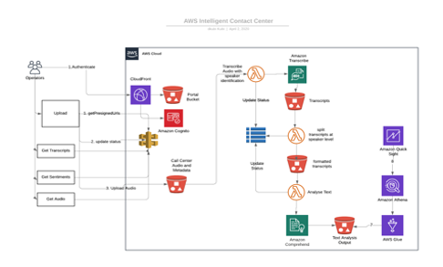

# quickstart-onica-cci-postcall-analytics

## Contact Center Intelligence - Post-call analytics on AWS

### Overview
This Quick Start reference deployment guide proivdes step-by-step instructions for deploying the Contact Center Intelligence post-call analytics solution on AWS Cloud.

The Quick Start enables contact centers to upload their recorded calls and receive insights from these call recordings. A portal created as part of the deployment, allow users to upload the call recordings and view the insights.

This Quick Start is available in all the AWS regions where the following services are available:
* AWS Glue
* Amazon Athena
* Amazon Transcribe
* Amazon Comprehend
* Amazon QuickSight
* Amazon CloudFront

### Architecture
Deploying this Quick Start with default parameters builds the following architecture in the AWS Cloud.

The CloudFormation template sets up the following serverless architecture:
* An S3 bucket that stores contact center audio recordings
* A Lambda function that transcribes the audio recordings to call transcripts 
* An S3 bucket that stores the transcripts
* A DynamoDB table that stores audio URI, transcript URI, text analysis URI and job status
* A lambda function that separates turns from the transcript 
* An S3 bucket that stores the separated turn transcripts 
* A lambda function that analyses the separated transcripts
* An S3 bucket that stores the text analysis output 
* A glue crawler that pulls metadata from the text analysis and a glue table
* An Athena Query that fetches turn by turn sentiment and scores
* Amazon API Gateway that exposes provisioning endpoints through HTTPS
* A dashboard integrated with QuickSight
* A CloudFront distribution to serve HTTPS request to an S3 Bucket hosting all the contents of the solution portal
* Amazon Cognito to manage users and give access to the solution portal.
* An S3 bucket to host the portal website

### Pre-requisites
Please make sure you have the following pre-requisites, before launch the CloudFormation templates to deploy the Quick Start.
1. •	An AWS account. If you do not already have an AWS account, create one at https://aws.amazon.com by following the on-screen instructions.
2. •	The ability to launch AWS CloudFormation templates that create IAM roles. Ideally, an AWS user with Administrative privileges.

### Deployment steps
1. Login to your AWS account.
2. Use the region selector in the navigation bar to choose the AWS Region in which you want to deploy the solution. We recommend to use us-east-1.
3. Click [Deploy](https://console.aws.amazon.com/cloudformation/home?region=us-east-1#/stacks/create/template?stackName=lex-kendra&templateURL=https://aws-quickstart.s3.amazonaws.com/quickstart-quantiphi-lex-kendra-backend/templates/lex_bot_kendra_master.template.yaml) to launch the CloudFormation template in your AWS Account. Click "Next".
4. In the 'Parameters' section, provide a stack name and review the parameter values. All the parameters have a default value. You may leave it as-is, and click Next.
5. On 'Configure stack options' screen, click Next.
6. Review the details, provide IAM_CAPABILITIES by clicking the check boxes under 'Capabilities' section, and click 'Create stack'. It will take approximately 20 minutes to create the stack.
7. Monitor the status of the stack. When the status is CREATE_COMPLETE, the stack is ready but may not be usable just yet. Depending on which region you deployed the stack, it may take a while for the CloudFront distribution to serve the portal.
8. You can find the portal URL in the Output section of the master stack with key 'PortalEndpoint'.
9. Follow the [Post-deployment](./Post-deployment.md) steps, to upload the call recording and view the insights.