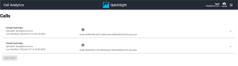

// Add steps as necessary for accessing the software, post-configuration, and testing. Don’t include full usage instructions for your software, but add links to your product documentation for that information.
//Should any sections not be applicable, remove them

== Test deployment

. Make a note of the portal URL in the Output section of the master stack with key PortalEndpoint.

. Create a User in Cognito under the *UserPool* Created by the stack. Visit this https://docs.aws.amazon.com/cognito/latest/developerguide/how-to-create-user-accounts.html[how-to^] guide to learn how to create a user in a Cognito pool if you’re not familiar with it. By default, usernames in this application must be full email addresses, and passwords must contain one of each of numeric, upper-case, lower-case and special characters; these constraints can be changed within the Cognito console.

. If you are logged into your AWS account in a browser window already, open the portal endpoint in a different *Incognito Window* as the portal attaches a QuickSight User Role that can interfere with your actual role.

. Go to the portal and login with the created user.  Upon initial login, you will be prompted to change the temporary password. After you’ve successfully changed the password, you will be directed to the main page where you can see the home page.
+
[#mainPage]
.Portal main page
[link=images/portal-main.png]
image::../images/portal-main.png[Portal main page,width=648,height=439]

. Click on the *Upload* button located in the upper right corner of the navigation bar.
. You will be taken to a page where you can upload audio files. 
. Click *Upload*. 
. After a successful upload of the audio files the audio processing will run through transcription and text analysis.
. Click on the *Call Analytics* Logo in the top left of the Navigation Bar to return to home page.
+
[#mainPageWithCalls]
.Portal page with calls
[link=images/portal-with-calls.png]

. Drill into a call to see *Amazon Comprehend*’s result of the call classifications and turn-by-turn sentiments.
. Click on the the [PLAY] icon on each call to playback the original audio file.  Note, not all browsers will be able to playback all file formats that this solution can process; this is due to playback being implemented via the HTML5 <audio> control, and format support is browser-specific.

== Post deployment steps

Following steps walk you through the process of how you can create QuickSight dashboards and visualizations to see call analytics and insights.

WARNING: Before you use QuickSight to create visualizations, make sure you have uploaded some audio files so that the glue crawler can create a table from the text_analysis_output bucket. The crawlers are set to run every hour. You can manually run the crawler if it hasn’t run yet. But the table has to exist before QuickSight Athena Connection will succeed.

=== Subscribe to Amazon QuickSight

. Sign in to your AWS account in a different browser or incognito window from the one you are running the ICC portal in (the quicksight user roles will conflict if you don’t) and open Amazon QuickSight from the AWS Management Console. It is located under Analytics, and you can find it by searching for "QuickSight".
. Your AWS account number is displayed for verification purposes. Choose *Sign up for QuickSight*.
. Choose *Standard*. To confirm, choose *Continue*. A screen titled *Create your QuickSight account* appears.
. Make choices for the following items:
** Type in a unique name for your Amazon QuickSight subscription account. Your account name can only contain characters (A–Z and a–z), digits (0–9), and hyphens (-).
** Type in your email address to receive Amazon QuickSight service and usage notifications.
** (Optional) Choose the AWS region you want to utilize for your default SPICE capacity. This is where your account’s free SPICE capacity is allocated after signing up. Note that you aren't able to change the default capacity region later, but you can always purchase additional SPICE capacity in different regions as needed. See AWS Regions, Websites, IP Address Ranges, and Endpoints for information on regions.
** (Optional) Choose whether to allow autodiscovery of your AWS resources. Give QuickSight access to the S3 buckets that begin with text_analysis_output and text_analysis_athena_results. You can change these options later in Manage Account. For more information, see Allowing Autodiscovery of AWS Resources.
. Review the choices you made, then choose *Finish*.

After you successfully complete signup, you are ready to explore what you can do with Amazon QuickSight.

To access QuickSight from the portal, Click on the QuickSight button in the center of the Nav bar. Enter your email address to associate with QuickSight.

=== Create new Analysis

. Click on *New Analysis* at the top left corner
. Click on *New Dataset*
. Select *Athena*
. Enter a Datasource name
. Click on *Create Datasource*
. Select use custom sql
. Go to Athena in your AWS console
. Select Saved Queries
. Click on the Query named “*Select Turn by turn sentiments*”
. Copy the Query
. Go back to your QuickSight tab and paste the query in the custom sql text area
. Click on *Confirm Query*
. If the Glue crawler has not yet run against your uploaded audio files then you will receive an error message similar to the following.
+
[#error]
.Crawler error
[link=images/crawler-error.png]
image::../images/crawler-error.png[Crawler error,width=648,height=439]

. If this is the case then this can be resolved as follows:
.. Navigate to the AWS Glue service in the AWS Console.
.. Select Crawlers, and select the text-analysis-metadata-crawler entry.
.. This will show both Tables updated and Tables created as 0 if the crawler hasn’t run.  If this is the case then hit the Run crawler button and wait for it to complete – at this time the Tables added field should have been set to 1.
. Finish your dataset creation by selecting directly query your data.
. Click on *visualize*.