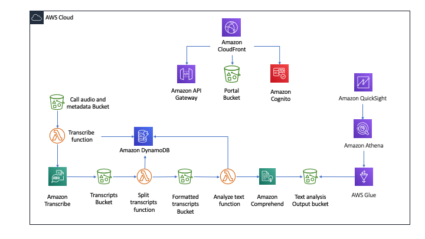

Deploying this Quick Start with *default parameters* builds the following _{partner-product-name}_ environment in the AWS Cloud.

// Replace this example diagram with your own. Send us your source PowerPoint file. Be sure to follow our guidelines here : http://(we should include these points on our contributors giude)
[#architecture1]
.Quick Start architecture for _{partner-product-name}_ on AWS
[link=../images/onica-pca-arch.png]

As shown in Figure 1, the Quick Start sets up the following:

* An S3 bucket that stores contact center audio recordings.
* A Lambda function that transcribes the audio recordings to call transcripts.
* An S3 bucket that stores the transcripts.
* A DynamoDB table that stores audio URI, transcript URI, text analysis URI and job status.
* A lambda function that separates turns from the transcript.
* An S3 bucket that stores the separated turn transcripts.
* A lambda function that analyses the separated transcripts.
* An S3 bucket that stores the text analysis output.
* A glue crawler that pulls metadata from the text analysis and a glue table.
* An Athena Query that fetches turn by turn sentiment and scores.
* Amazon API Gateway that exposes provisioning endpoints through HTTPS.
* A dashboard integrated with QuickSight.
* A CloudFront distribution to serve HTTPS request to an S3 Bucket hosting all the contents of the solution portal.
* Amazon Cognito to manage users and give access to the solution portal.
* An S3 bucket to host the portal website.
