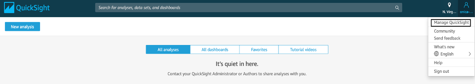
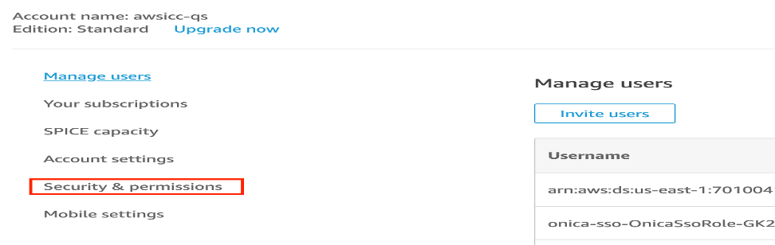
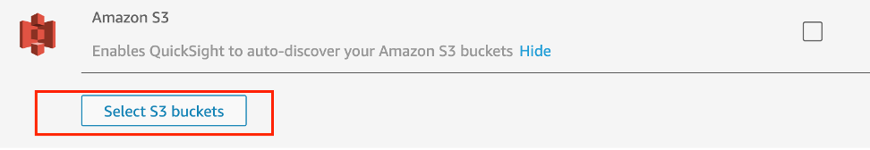
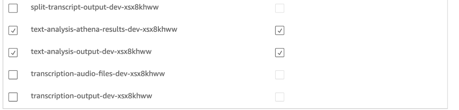
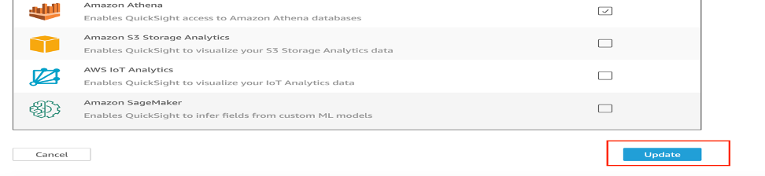

// Add any tips or answers to anticipated questions. This could include the following troubleshooting information. If you don’t have any other Q&A to add, change “FAQ” to “Troubleshooting.”

== FAQ

*Q.* I encountered a *CREATE_FAILED* error when I launched the Quick Start.

*A.* If AWS CloudFormation fails to create the stack, we recommend that you relaunch the template with *Rollback on failure* set to *No*. (This setting is under *Advanced* in the AWS CloudFormation console, *Options* page.) With this setting, the stack’s state is retained and the instance is left running, so you can troubleshoot the issue. (For Windows, look at the log files in %ProgramFiles%\Amazon\EC2ConfigService and C:\cfn\log.)
// If you’re deploying on Linux instances, provide the location for log files on Linux, or omit this sentence.

WARNING: When you set *Rollback on failure* to *Disabled*, you continue to incur AWS charges for this stack. Please make sure to delete the stack when you finish troubleshooting.

For additional information, see https://docs.aws.amazon.com/AWSCloudFormation/latest/UserGuide/troubleshooting.html[Troubleshooting AWS CloudFormation^] on the AWS website.

*Q.* I encountered a size limitation error when I deployed the AWS CloudFormation templates.

*A.* We recommend that you launch the Quick Start templates from the links in this guide or from another S3 bucket. If you deploy the templates from a local copy on your computer or from a location other than an S3 bucket, you might encounter template size limitations. For more information about AWS CloudFormation quotas, see the http://docs.aws.amazon.com/AWSCloudFormation/latest/UserGuide/cloudformation-limits.html[AWS documentation^].

== Troubleshooting

* If at any point in time you notice any weird permission errors in your account, try switching the user role in the top right corner of your AWS account.

* If QuickSight fails to execute queries due to S3 errors, then you will have to go to manage account in QuickSight and re add the _text_analysis_output_ and _text_analysis_athena_results_ buckets of your current deployment.

.. Click _Manage QuickSight_
+

.. Click on _Security & Permissions_
+

.. Click on _Add or remove_
+
image::../images/add-or-remove.png[Add or remove,width=648,height=439]

.. Click on _Details_, under Amazon S3
+
image::../images/details-s3.png[S3 Details,width=648,height=439]

.. Click on _Select S3 buckets_
+

.. Select buckets prefixed with _text-analysis-output_ and _text-analysis-athena-results_
+

.. Click on _Update_ to save your changes
+

For more QuickSight help, see https://docs.aws.amazon.com/quicksight/latest/user/getting-started.html